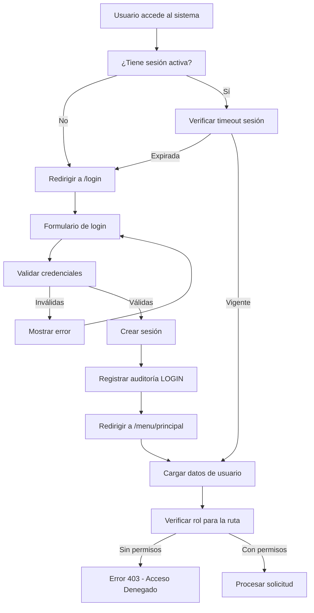
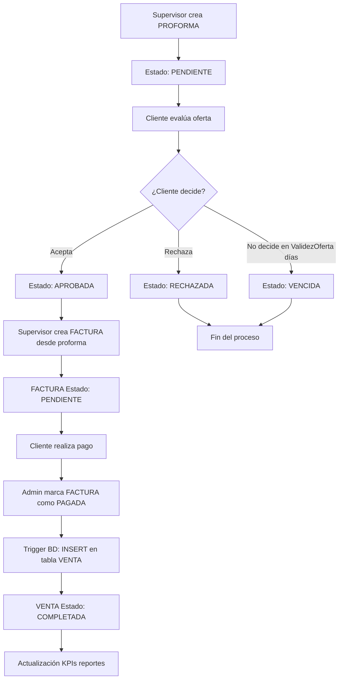
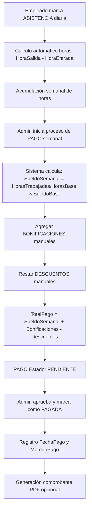

# 📋 ANEXO 1: MATRIZ DE SERVICIOS
## TRABAJO DE APLICACIÓN PROFESIONAL (TAP)

---

**Título**: Sistema de Gestión de Proformas, Facturas y Recursos Humanos  
**Empresa**: CARSIL Equipos y Servicios SAC  
**Autor**: [Nombre del Estudiante]  
**Fecha**: 12 de Marzo de 2026  
**Programa**: [Programa Académico]  
**Institución**: [Institución Educativa]

---

## 🎯 1. DESCRIPCIÓN GENERAL DEL SISTEMA

### 1.1 Nombre del Proyecto
**Sistema Integral de Gestión Empresarial CARSIL** - Plataforma web para gestión de cotizaciones (proformas), facturación, control de inventario de bombas hidráulicas, recursos humanos y reportes analíticos.

### 1.2 Objetivo General
Desarrollar una solución web integral que permita a CARSIL Equipos y Servicios SAC automatizar y optimizar sus procesos comerciales, desde la generación de proformas hasta el control de facturación y la gestión de recursos humanos, mejorando la eficiencia operativa y proporcionando trazabilidad completa de todas las transacciones.

### 1.3 Objetivos Específicos
- **OE1**: Automatizar el proceso de generación, seguimiento y conversión de proformas comerciales
- **OE2**: Implementar un sistema de facturación electrónica con trazabilidad completa
- **OE3**: Gestionar el inventario de productos (bombas hidráulicas) con control de stock
- **OE4**: Administrar la información de clientes empresariales con histórico transaccional
- **OE5**: Automatizar el cálculo de nóminas basado en registros de asistencia
- **OE6**: Proporcionar reportes analíticos y KPIs para la toma de decisiones
- **OE7**: Garantizar la seguridad y auditoría de todas las operaciones del sistema

### 1.4 Alcance del Proyecto
**Incluye:**
- 14 módulos funcionales completamente integrados
- Sistema de roles y permisos (3 niveles: Administrador, Supervisor, Empleado)
- Base de datos MySQL con 23 tablas relacionales
- Interfaz web responsive con tecnología EJS
- Generación de documentos PDF profesionales
- Sistema de notificaciones en tiempo real
- Auditoría completa de todas las transacciones
- Integración de email para envío de documentos

**No Incluye:**
- Integración directa con SUNAT para facturación electrónica oficial
- Aplicación móvil nativa
- Integración con sistemas contables externos
- Módulo de compras a proveedores

### 1.5 Stack Tecnológico

| Categoría | Tecnología | Versión | Propósito |
|-----------|------------|---------|-----------|
| **Backend** | Node.js | 18.x+ | Motor de aplicación |
| **Framework** | Express.js | 4.18+ | Framework web |
| **Base de Datos** | MySQL | 5.7+ | Sistema gestor de BD |
| **Frontend** | EJS | 3.1+ | Motor de plantillas |
| **Autenticación** | Bcrypt + Express-session | - | Seguridad |
| **PDF Generation** | PDFKit | 0.13+ | Documentos PDF |
| **Email Service** | Nodemailer | 6.9+ | Envío de emails |
| **Testing** | Jest | 29.x | Pruebas unitarias |
| **UI Framework** | Bootstrap | 5.3+ | Estilos y componentes |

---

## 🚀 2. FUNCIONALIDADES PRINCIPALES

### 2.1 Módulo de Proformas (Cotizaciones Comerciales)
**Descripción**: Sistema completo de gestión de cotizaciones con validez automática y seguimiento de estados.

**Funcionalidades**:
- ✅ Creación de proformas con código auto-secuencial (PROF-NNN)
- ✅ Cálculo automático de IGV (18%), subtotal y total
- ✅ Gestión de estados: PENDIENTE → APROBADA → RECHAZADA → VENCIDA
- ✅ Auto-vencimiento basado en ValidezOferta configurda
- ✅ Generación de PDF profesional para descarga
- ✅ Envío de proforma por email al cliente
- ✅ Conversión automática de proforma aprobada a factura
- ✅ Histórico completo con filtros por cliente, estado y fechas

### 2.2 Módulo de Facturas (Facturación Empresarial)
**Descripción**: Sistema de facturación con trazabilidad completa y control de pagos.

**Funcionalidades**:
- ✅ Creación desde proforma aprobada o directa (venta sin cotización)
- ✅ Estados de factura: PENDIENTE → PAGADA → ANULADA
- ✅ Generación automática de registro de VENTA al marcar como PAGADA
- ✅ PDF descargable con formato legal
- ✅ Envío directo por email al cliente
- ✅ Control de fechas de emisión y vencimiento
- ✅ Vinculación automática con proforma de origen

### 2.3 Módulo de Productos (Catálogo de Bombas)
**Descripción**: Gestión completa del inventario de bombas hidráulicas y accesorios.

**Funcionalidades**:
- ✅ Catálogo de productos con códigos únicos
- ✅ Control de stock con alertas por stock mínimo
- ✅ Gestión de precios unitarios
- ✅ Clasificación por tipo: Sumergibles, Centrífugas, Hidroneumáticas, etc.
- ✅ Datos técnicos: Marca, Modelo, Potencia, Especificaciones
- ✅ Estados: Activo/Inactivo (sin eliminar historial)
- ✅ Búsqueda avanzada por múltiples criterios

### 2.4 Módulo de Clientes (CRM Empresarial)
**Descripción**: Gestión integral de clientes empresariales con histórico transaccional.

**Funcionalidades**:
- ✅ Registro de clientes con datos fiscales (RUC/DNI)
- ✅ Información de contacto completa
- ✅ Histórico de proformas y facturas por cliente
- ✅ Estados: Activo/Inactivo
- ✅ Validación de documentos únicos
- ✅ Búsqueda por razón social, documento o email

### 2.5 Módulo de Recursos Humanos
**Descripción**: Gestión completa de empleados, asistencias y nóminas automatizadas.

#### 2.5.1 Submódulo de Empleados
- ✅ Registro de datos personales y laborales
- ✅ Vinculación 1:1 con usuarios del sistema
- ✅ Control de cargos, áreas y fechas de contratación
- ✅ Datos bancarios para transferencias
- ✅ Estados laborales: Activo, Inactivo, Licencia

#### 2.5.2 Submódulo de Asistencias
- ✅ Registro diario de entrada y salida
- ✅ Cálculo automático de horas trabajadas
- ✅ Estados: Presente, Tardanza, Ausente, Feriado
- ✅ Jornadas: Completa (8h), Media Mañana (4h), Media Tarde (4h)
- ✅ Validación: Una entrada por empleado por día

#### 2.5.3 Submódulo de Pagos (Nómina)
- ✅ Cálculo automático basado en asistencias
- ✅ Fórmula: (HorasTrabajadas / HorasBase) × SueldoBase
- ✅ Gestión de bonificaciones y descuentos
- ✅ Pagos semanales con estados: Pendiente/Pagada
- ✅ Generación de comprobantes de pago

### 2.6 Módulo de Usuarios y Seguridad
**Descripción**: Sistema completo de autenticación, autorización y control de acceso.

**Funcionalidades**:
- ✅ Autenticación con email y contraseña hasheada (Bcrypt)
- ✅ Sistema de roles: Administrador, Supervisor, Empleado
- ✅ Control de permisos granular por módulo
- ✅ Sesiones seguras con timeout automático
- ✅ Recuperación de contraseña por email
- ✅ Auditoría de accesos (login/logout)

### 2.7 Módulo de Reportes y Analytics
**Descripción**: Dashboard analítico con KPIs y reportes para toma de decisiones.

**Funcionalidades**:
- ✅ Dashboard principal con métricas en tiempo real
- ✅ Gráfico de evolución mensual de proformas
- ✅ Distribución por estados (pie chart)
- ✅ Top 10 clientes por volumen de negocio
- ✅ KPIs de conversión (proforma → factura → venta)
- ✅ Filtros por períodos temporales
- ✅ Exportación de reportes a PDF

### 2.8 Módulo de Auditoría
**Descripción**: Trazabilidad completa de todas las operaciones del sistema.

**Funcionalidades**:
- ✅ Registro automático de todas las operaciones CRUD
- ✅ Log de accesos de usuario con IP y timestamp
- ✅ Filtros por módulo, acción y usuario
- ✅ Búsqueda de auditoría por descripción
- ✅ Retención de logs sin eliminación (7 años)

### 2.9 Módulo de Notificaciones
**Descripción**: Sistema de alertas en tiempo real para operaciones importantes.

**Funcionalidades**:
- ✅ Notificaciones automáticas por cada operación CRUD
- ✅ Badge contador de notificaciones no leídas
- ✅ Lista de notificaciones recientes (últimas 20)
- ✅ Marcado individual y masivo como leída
- ✅ Iconografía diferenciada por tipo de operación

### 2.10 Módulo de Configuración Empresarial
**Descripción**: Configuración de datos de la empresa y personalización.

**Funcionalidades**:
- ✅ Gestión de datos empresariales (RUC, nombre, dirección)
- ✅ Upload y gestión de logo empresarial
- ✅ Configuración de cuentas bancarias
- ✅ Texto de presentación para documentos
- ✅ Configuración de parámetros de email

---

## 📋 3. MATRIZ COMPLETA DE SERVICIOS Y REQUISITOS FUNCIONALES

### Estructura de la Matriz de Servicios

**Columnas de la Matriz:**
1. **ID Requisito/Servicio**: Código único de identificación
2. **Nombre del Servicio/Funcionalidad**: Título breve y claro
3. **Descripción Detallada**: Explicación precisa del servicio y actor destinatario
4. **Módulo**: Parte del sistema a la que pertenece
5. **Historia de Usuario (HU) Asociada**: Referencia a la HU de origen
6. **Prioridad**: Nivel de importancia (Alta/Media/Baja)
7. **Estado**: Fase de desarrollo actual
8. **Criterios de Aceptación**: Condiciones de satisfacción del cliente

---

| **ID** | **Nombre del Servicio/Funcionalidad** | **Descripción Detallada** | **Módulo** | **HU Asociada** | **Prioridad** | **Estado** | **Criterios de Aceptación** |
|--------|---------------------------------------|---------------------------|------------|----------------|---------------|------------|----------------------------|
| **RF-001** | Creación de Proforma Comercial | Permite al usuario Supervisor/Admin crear documentos de cotización con código auto-secuencial PROF-NNN, seleccionando cliente, productos y calculando automáticamente IGV (18%) | Módulo de Ventas y Cotizaciones | HU-01 | **Alta** | Implementado | Código único generado, tiempo de creación < 2 minutos, cálculos automáticos correctos |
| **RF-002** | Cálculo Automático de Impuestos | El sistema calcula automáticamente SubTotal, IGV (18%) y Total en proformas y facturas sin intervención manual del usuario | Módulo de Ventas y Cotizaciones | HU-01 | **Alta** | Implementado | IGV = SubTotal × 0.18, Total = SubTotal + IGV, precisión 2 decimales |
| **RF-003** | Verificación de Proformas Vencidas | Sistema verifica automáticamente las proformas que superaron su ValidezOferta y cambia su estado a VENCIDA en cada consulta de listado | Módulo de Ventas y Cotizaciones | HU-02 | **Alta** | Implementado | Verificación automática cada lista, actualización masiva en < 3 segundos |
| **RF-004** | Conversión Proforma a Factura | Permite al Supervisor crear una factura heredando automáticamente los datos del cliente, productos y empresa desde una proforma aprobada | Módulo de Facturación | HU-03 | **Alta** | Implementado | Herencia completa de datos, código FAC-NNN generado, tiempo < 30 segundos |
| **RF-005** | Generación de PDF Profesional | Genera documentos PDF de proformas y facturas con formato A4, logo empresa, datos completos y diseño profesional para descarga e impresión | Módulo de Documentos | HU-04 | **Alta** | Implementado | PDF en formato A4, logo visible, tiempo generación < 10 segundos |
| **RF-006** | Envío de Documentos por Email | Envía proformas y facturas en PDF al email del cliente utilizando Nodemailer con validación de email y manejo de errores | Servicio de Email | HU-05 | **Media** | Implementado | Email entregado, PDF adjunto, manejo graceful de errores SMTP |
| **RF-007** | Registro Automático de Ventas | Cuando una factura cambia a estado PAGADA, el sistema automáticamente registra una entrada en la tabla VENTA mediante trigger de BD | Módulo de Ventas | HU-06 | **Alta** | Implementado | Trigger ejecutado correctamente, relación 1:1 factura-venta |
| **RF-008** | Gestión de Catálogo de Productos | Administrador puede crear, editar y gestionar bombas hidráulicas con códigos únicos, precios, stock y especificaciones técnicas | Módulo de Inventario | HU-07 | **Alta** | Implementado | Código único validado, no duplicados, búsqueda < 2 segundos |
| **RF-009** | Control de Stock con Alertas | Sistema monitorea automáticamente el stock de productos y genera alertas cuando Stock < StockMinimo en reportes | Módulo de Inventario | HU-08 | **Alta** | Implementado | Alerta visible en dashboard, notificación automática |
| **RF-010** | Búsqueda Avanzada de Productos | Permite búsqueda de productos por múltiples criterios: código, nombre, marca, modelo, tipo de bomba desde formularios de proforma/factura | Módulo de Inventario | HU-09 | **Media** | Implementado | Resultados en < 1 segundo, coincidencias parciales, filtros múltiples |
| **RF-011** | Preservación de Precios Históricos | Los cambios de precio en productos NO afectan las proformas y facturas ya creadas, manteniendo integridad histórica de transacciones | Módulo de Inventario | HU-10 | **Alta** | Implementado | Precios históricos intactos al modificar precio actual |
| **RF-012** | Validación de Documentos de Cliente | Sistema valida que documentos RUC/DNI sean únicos y tengan formato correcto (RUC=11 dígitos, DNI=8 dígitos) antes de crear cliente | Módulo CRM | HU-11 | **Alta** | Implementado | Validación formato correcta, constraint UNIQUE en BD |
| **RF-013** | Histórico Completo por Cliente | Muestra todas las proformas y facturas asociadas a un cliente específico con filtros por fecha y estado desde vista de detalle del cliente | Módulo CRM | HU-12 | **Alta** | Implementado | Lista completa visible, filtros funcionales, carga < 2 segundos |
| **RF-014** | Desactivación Segura de Clientes | Permite cambiar estado del cliente a INACTIVO sin eliminar registros, manteniendo integridad referencial con proformas y facturas existentes | Módulo CRM | HU-13 | **Media** | Implementado | Cliente inactivo no aparece en listas nuevas, histórico preservado |
| **RF-015** | Registro de Asistencia Diaria | Empleados pueden marcar entrada y salida diaria con constraint de una sola entrada por empleado por día | Módulo de RR.HH. | HU-14 | **Alta** | Implementado | Una entrada por día por empleado, constraint UNIQUE validado |
| **RF-016** | Cálculo Automático de Horas Trabajadas | Sistema calcula automáticamente las horas trabajadas como diferencia entre HoraSalida y HoraEntrada usando campo GENERATED en BD | Módulo de RR.HH. | HU-15 | **Alta** | Implementado | Cálculo automático correcto, campo GENERATED funcionando |
| **RF-017** | Cálculo de Nómina Basada en Asistencias | Admin puede generar pagos semanales calculando: (ΣHorasTrabajadas/HorasBase) × SueldoBase + Bonificaciones - Descuentos | Módulo de Nóminas | HU-16 | **Alta** | Implementado | Cálculo matemático correcto, suma de asistencias del período |
| **RF-018** | Validación de Unicidad de Pagos | Sistema previene crear múltiples pagos para el mismo empleado en la misma semana del mismo año mediante constraint UNIQUE | Módulo de Nóminas | HU-17 | **Alta** | Implementado | Error controlado al intentar duplicar pago, constraint funcionando |
| **RF-019** | Autenticación con Contraseñas Seguras | Usuarios se autentican con email y contraseña hasheada usando Bcrypt con costo 10, almacenando 60 caracteres en BD | Módulo de Seguridad | HU-18 | **Alta** | Implementado | Bcrypt costo 10 aplicado, login funcional, hash correcto |
| **RF-020** | Control de Acceso Basado en Roles (RBAC) | Sistema implementa 3 roles con permisos diferenciados: Administrador (total), Supervisor (comercial), Empleado (asistencia) | Módulo de Seguridad | HU-19 | **Alta** | Implementado | Permisos por rol funcionando, acceso denegado cuando corresponde |
| **RF-021** | Auditoría Completa de Operaciones | Todas las operaciones CRUD registran automáticamente: usuario, IP, módulo, acción, timestamp en tabla AUDITORIA | Módulo de Auditoría | HU-20 | **Alta** | Implementado | Log automático en cada operación, datos completos registrados |
| **RF-022** | Validación de Permisos Pre-Ejecución | Middleware verificarRol valida permisos del usuario antes de ejecutar controladores en rutas protegidas | Módulo de Seguridad | HU-21 | **Alta** | Implementado | Middleware ejecutándose, bloqueo efectivo de accesos no autorizados |
| **RF-023** | Dashboard con KPIs en Tiempo Real | Muestra métricas comerciales actualizadas: total proformas, tasa conversión, ventas del mes, nuevos clientes obtenidos de BD real | Módulo de Reportes | HU-22 | **Alta** | Implementado | Datos reales de BD, actualización automática, KPIs precisos |
| **RF-024** | Gráficos de Evolución Temporal | Genera gráficos de barras con Chart.js mostrando evolución mensual de proformas de los últimos 7 meses con cantidad y montos | Módulo de Reportes | HU-23 | **Alta** | Implementado | Gráficos generados correctamente, datos de últimos 7 meses |
| **RF-025** | Cálculo de Tasa de Conversión | Calcula y muestra % de conversión: (Ventas Completadas / Proformas Emitidas) × 100 y (Facturas Pagadas / Proformas Aprobadas) × 100 | Módulo de Reportes | HU-24 | **Alta** | Implementado | Fórmulas matemáticas correctas, % mostrado con 2 decimales |
| **RF-026** | Exportación de Reportes a PDF | Genera reportes descargables en PDF incluyendo gráficos, KPIs y tablas de datos para respaldo físico o presentaciones | Módulo de Reportes | HU-25 | **Media** | Implementado | PDF descargable, gráficos incluidos, formato profesional |
| **RF-027** | Notificaciones Automáticas por Operaciones | Sistema genera automáticamente notificaciones después de cada operación CREATE, UPDATE, DELETE con tipo de acción e icono diferenciado | Módulo de Notificaciones | HU-26 | **Media** | Implementado | Notificación creada automáticamente, iconografía diferenciada |
| **RF-028** | Contador de Notificaciones No Leídas | Muestra badge con número de notificaciones no leídas en la interfaz, actualizado cada 15 segundos mediante polling | Módulo de Notificaciones | HU-27 | **Baja** | Implementado | Badge visible, contador actualizado, polling cada 15s |
| **RF-029** | Gestión de Datos Empresariales | Administrador puede editar datos de la empresa CARSIL: RUC, nombre, dirección, teléfono, logo, cuenta bancaria para personalización | Módulo Administrativo | HU-28 | **Media** | Implementado | Datos editables, logo upload funcional, cambios reflejados en PDF |
| **RF-030** | Lista de Usuario por Roles | Administrador puede ver todos los usuarios registrados agrupados por rol con posibilidad de editar información personal y cambiar roles | Módulo de Usuarios | HU-29 | **Media** | Implementado | Lista completa visible, edición funcional, cambio de rol efectivo |
| **RF-031** | Recuperación de Contraseña por Email | Usuario puede solicitar reset de contraseña ingresando email, sistema envía link de recuperación con token temporal de un solo uso | Módulo de Seguridad | HU-30 | **Media** | Implementado | Email de recuperación enviado, token temporal válido |
| **RF-032** | Filtrado Avanzado en Listados | Todos los módulos principales (proformas, facturas, clientes, productos) incluyen filtros por estado, fecha, cliente para búsqueda rápida | Módulos Transversales | HU-31 | **Media** | Implementado | Filtros funcionando, resultados en < 2 segundos |
| **RF-033** | Paginación en Listados Grandes | Listados con más de 50 registros implementan paginación automática para mejorar performance y experiencia de usuario | Módulos Transversales | HU-32 | **Baja** | Implementado | Paginación automática, navegación entre páginas funcional |
| **RF-034** | Breadcrumbs de Navegación | Interfaz muestra ruta de navegación actual permitiendo retroceder fácilmente a secciones anteriores desde cualquier vista | Módulo de Interfaz | HU-33 | **Baja** | Implementado | Breadcrumbs visibles, navegación hacia atrás funcional |
| **RF-035** | Menú Adaptativo por Rol | Menú lateral muestra únicamente las opciones disponibles según el rol del usuario logueado (Admin: todo, Supervisor: comercial, Empleado: asistencia) | Módulo de Interfaz | HU-34 | **Alta** | Implementado | Menú diferenciado por rol, opciones correctas mostradas |
| **RF-036** | Sesión con Timeout Automático | Sesiones de usuario expiran automáticamente después de 20 minutos de inactividad redirigiendo al login con mensaje informativo | Módulo de Seguridad | HU-35 | **Media** | Implementado | Timeout a los 20 minutos, redirección automática funcional |
| **RF-037** | Validación de Campos en Formularios | Todos los formularios incluyen validación HTML5 en cliente y revalidación en servidor antes de procesar datos | Módulos Transversales | HU-36 | **Alta** | Implementado | Validación dual funcionando, errores mostrados claramente |
| **RF-038** | Flash Messages de Retroalimentación | Sistema muestra mensajes de éxito/error después de cada operación informando al usuario el resultado de su acción | Módulos Transversales | HU-37 | **Media** | Implementado | Mensajes claros mostrados, desaparecen automáticamente |
| **RF-039** | Búsqueda Global en Auditoría | Permite buscar en auditoría por descripción, módulo, usuario o acción para facilitar investigaciones y seguimientos | Módulo de Auditoría | HU-38 | **Media** | Implementado | Búsqueda funcionando, resultados relevantes en < 2 segundos |
| **RF-040** | Estados Controlados en Proformas | Proformas solo pueden cambiar entre estados válidos: PENDIENTE→APROBADA/RECHAZADA/VENCIDA con validaciones de negocio | Módulo de Ventas y Cotizaciones | HU-39 | **Alta** | Implementado | Transiciones de estado válidas, validaciones de negocio aplicadas |

---

## ⚙️ 4. MATRIZ DE REQUISITOS NO FUNCIONALES (RNF)

### 4.1 Requisitos de Rendimiento

| **ID** | **Categoría** | **Descripción** | **Especificación** | **Método de Verificación** |
|--------|---------------|-----------------|-------------------|---------------------------|
| **RNF-001** | Tiempo de Respuesta | Tiempo máximo de respuesta para operaciones de listado | **≤ 2 segundos** | Pruebas de carga con herramientas de testing |
| **RNF-002** | Tiempo de Respuesta | Tiempo máximo de respuesta para operaciones CRUD individuales | **≤ 1 segundo** | Medición con herramientas de profiling |
| **RNF-003** | Concurrencia | Número de usuarios concurrentes soportados | **500 usuarios simultáneos** | Pruebas de estrés con herramientas como JMeter |
| **RNF-004** | Base de Datos | Pool de conexiones MySQL | **5-10 conexiones concurrentes** | Configuración en conexion.js |
| **RNF-005** | Escalabilidad | Capacidad de crecimiento de datos | **1M+ proformas/facturas** | Diseño de índices y estructura BD |

### 4.2 Requisitos de Seguridad

| **ID** | **Categoría** | **Descripción** | **Especificación** | **Método de Verificación** |
|--------|---------------|-----------------|-------------------|---------------------------|
| **RNF-006** | Autenticación | Algoritmo de hash para contraseñas | **Bcrypt con costo 10** | Auditoría de código y pruebas |
| **RNF-007** | Sesiones | Timeout de sesión por inactividad | **20 minutos** | Configuración express-session |
| **RNF-008** | Control de Acceso | Implementación de RBAC | **3 roles con permisos granulares** | Matriz de permisos y pruebas funcionales |
| **RNF-009** | Auditoría | Retención de logs de auditoría | **7 años mínimo** | Política de base de datos |
| **RNF-010** | Protección de Datos | Cumplimiento PDPL (Ley Peruana) | **Datos personales protegidos** | Auditoría de cumplimiento legal |
| **RNF-011** | CSRF Protection | Prevención de ataques CSRF | **Method-override middleware** | Pruebas de seguridad |

### 4.3 Requisitos de Disponibilidad

| **ID** | **Categoría** | **Descripción** | **Especificación** | **Método de Verificación** |
|--------|---------------|-----------------|-------------------|---------------------------|
| **RNF-012** | Uptime | Disponibilidad del sistema | **99.5% (4 horas downtime/mes)** | Monitoreo de disponibilidad |
| **RNF-013** | Recuperación | Manejo grácil de errores | **Try-catch en funciones críticas** | Auditoría de código |
| **RNF-014** | Backup | Frecuencia de respaldos de BD | **Diarios a las 02:00 UTC** | Scripts automatizados |
| **RNF-015** | Health Check | Endpoint de verificación de salud | **GET /health → BD connection check** | Monitoreo activo |

### 4.4 Requisitos de Usabilidad

| **ID** | **Categoría** | **Descripción** | **Especificación** | **Método de Verificación** |
|--------|---------------|-----------------|-------------------|---------------------------|
| **RNF-016** | Interfaz | Diseño responsive | **Mobile-first, funcional en tablets/smartphones** | Pruebas en múltiples dispositivos |
| **RNF-017** | Navegadores | Compatibilidad cross-browser | **Chrome, Firefox, Safari, Edge (versiones recientes)** | Pruebas de compatibilidad |
| **RNF-018** | Accesibilidad | Cumplimiento de estándares | **WCAG 2.1 AA mínimo** | Auditorías de accesibilidad |
| **RNF-019** | Feedback | Mensajes de respuesta al usuario | **Flash messages en cada operación** | Pruebas de experiencia de usuario |
| **RNF-020** | Navegación | Estructura intuitiva | **Menú claro, breadcrumbs, búsquedas** | Evaluación de UX |

### 4.5 Requisitos de Mantenibilidad

| **ID** | **Categoría** | **Descripción** | **Especificación** | **Método de Verificación** |
|--------|---------------|-----------------|-------------------|---------------------------|
| **RNF-021** | Arquitectura | Patrón de diseño | **MVC (Model-View-Controller)** | Revisión de estructura de código |
| **RNF-022** | Documentación | Código documentado | **Comentarios en funciones complejas** | Auditoría de documentación |
| **RNF-023** | Estándares | Nomenclatura consistente | **camelCase JS, SNAKE_CASE SQL** | Revisión de código |
| **RNF-024** | Versionado | Control de versiones | **Git con commits descriptivos** | Historial de repositorio |
| **RNF-025** | Testing | Cobertura de pruebas | **Mínimo 70% con Jest** | Reportes de cobertura |
| **RNF-026** | Modularidad | Reutilización de componentes | **Middleware reutilizable (auth, audit, etc.)** | Análisis de arquitectura |

### 4.6 Requisitos de Portabilidad

| **ID** | **Categoría** | **Descripción** | **Especificación** | **Método de Verificación** |
|--------|---------------|-----------------|-------------------|---------------------------|
| **RNF-027** | Sistema Operativo | Compatibilidad multiplataforma | **Windows, Linux, macOS** | Pruebas en diferentes SO |
| **RNF-028** | Base de Datos | Motor de BD | **MySQL 5.7+ o MariaDB 10.3+** | Pruebas de compatibilidad |
| **RNF-029** | Contenedorización | Preparado para Docker | **Dockerfile y docker-compose.yml** | Despliegue en contenedores |

### 4.7 Requisitos de Cumplimiento Legal

| **ID** | **Categoría** | **Descripción** | **Especificación** | **Método de Verificación** |
|--------|---------------|-----------------|-------------------|---------------------------|
| **RNF-030** | Facturación | Formato compatible SUNAT | **HTML/PDF con estructura legal** | Validación con normativas |
| **RNF-031** | Retención | Conservación de registros | **Auditoría 7 años, transacciones permanente** | Políticas de retención |
| **RNF-032** | Protección | Cumplimiento PDPL | **Protección datos personales Perú** | Auditoría legal |

---

## 🏗️ 5. ARQUITECTURA DEL SISTEMA

### 5.1 Patrón Arquitectónico
**Modelo-Vista-Controlador (MVC)** con separación clara de responsabilidades:

- **Modelo (Model)**: Lógica de acceso a datos y reglas de negocio
- **Vista (View)**: Interfaz de usuario con plantillas EJS
- **Controlador (Controller)**: Intermediario entre modelo y vista

### 5.2 Estructura de Capas

```
┌─────────────────────────────────────────────┐
│  CAPA DE PRESENTACIÓN (EJS Templates)      │
│  • Formularios, listados, reportes         │
│  • Bootstrap 5.3 + CSS personalizado       │
└─────────────────┬───────────────────────────┘
                  │
┌─────────────────┴───────────────────────────┐
│  CAPA DE APLICACIÓN (Controllers)          │
│  • Lógica de negocio                       │
│  • Validaciones                            │
│  • Orchestración de servicios              │
└─────────────────┬───────────────────────────┘
                  │
┌─────────────────┴───────────────────────────┐
│  CAPA DE SERVICIOS (Models + Services)     │
│  • Acceso a datos                          │
│  • Email service                           │
│  • PDF generation                          │
└─────────────────┬───────────────────────────┘
                  │
┌─────────────────┴───────────────────────────┐
│  CAPA DE DATOS (MySQL Database)            │
│  • 23 tablas relacionales                  │
│  • Triggers y constraints                  │
│  • Índices optimizados                     │
└─────────────────────────────────────────────┘
```

### 5.3 Componentes del Sistema

#### 5.3.1 Backend Components
- **Express.js Server**: Motor de aplicación web
- **MySQL Pool**: Gestión eficiente de conexiones BD
- **Session Management**: Autenticación y estado de usuario
- **Email Service**: Nodemailer para envío de documentos
- **PDF Generator**: PDFKit para documentos profesionales
- **Audit Middleware**: Trazabilidad automática de operaciones

#### 5.3.2 Frontend Components
- **EJS Templates**: Motor de plantillas server-side
- **Bootstrap Framework**: Framework CSS responsive
- **Chart.js**: Visualización de datos y reportes
- **Bootstrap Icons**: Iconografía profesional
- **Custom CSS**: estilos específicos del dominio

#### 5.3.3 Database Components
- **23 Tablas Principales**: Estructura normalizada
- **Foreign Keys**: Integridad referencial
- **Triggers**: Automatización de procesos
- **Stored Procedures**: Lógica compleja en BD
- **Indexes**: Optimización de consultas

---

## 👥 6. MATRIZ DE USUARIOS Y ROLES

### 6.1 Definición de Roles

| **Rol** | **ID** | **Descripción** | **Nivel de Acceso** |
|---------|--------|-----------------|-------------------|
| **Administrador** | 1 | Control total del sistema, configuración avanzada | **TOTAL** |
| **Supervisor** | 2 | Operaciones comerciales y consulta de reportes | **LIMITADO** |
| **Empleado** | 3 | Solo registro de asistencias y perfil personal | **MÍNIMO** |

### 6.2 Matriz Detallada de Permisos

| **Módulo/Operación** | **Admin** | **Supervisor** | **Empleado** | **Observaciones** |
|----------------------|-----------|----------------|--------------|------------------|
| **PROFORMAS** |  |  |  |  |
| Crear | ✅ | ✅ | ❌ | - |
| Listar | ✅ | ✅ | ❌ | - |
| Editar | ✅ | ✅ | ❌ | Solo si Estado=PENDIENTE |
| Cambiar Estado | ✅ | ✅ | ❌ | Todas las transiciones |
| Eliminar/Inactivar | ✅ | ❌ | ❌ | Solo Admin |
| Generar PDF | ✅ | ✅ | ❌ | - |
| Enviar Email | ✅ | ✅ | ❌ | - |
| **FACTURAS** |  |  |  |  |
| Crear | ✅ | ✅ | ❌ | Desde proforma o directa |
| Listar | ✅ | ✅ | ❌ | - |
| Editar | ✅ | ✅ | ❌ | Solo si Estado=PENDIENTE |
| Cambiar Estado PAGADA | ✅ | ❌ | ❌ | Solo Admin (importante) |
| Anular | ✅ | ❌ | ❌ | Solo Admin |
| Generar PDF | ✅ | ✅ | ❌ | - |
| Enviar Email | ✅ | ✅ | ❌ | - |
| **CLIENTES** |  |  |  |  |
| Crear | ✅ | ✅ | ❌ | - |
| Listar | ✅ | ✅ | ❌ | - |
| Editar | ✅ | ✅ | ❌ | Datos de contacto |
| Eliminar/Inactivar | ✅ | ❌ | ❌ | Solo Admin |
| **PRODUCTOS** |  |  |  |  |
| Crear | ✅ | ❌ | ❌ | Solo Admin |
| Listar | ✅ | ✅ | ❌ | Supervisor: solo lectura |
| Editar Precio | ✅ | ❌ | ❌ | Solo Admin |
| Editar Stock | ✅ | ❌ | ❌ | Solo Admin |
| Eliminar/Inactivar | ✅ | ❌ | ❌ | Solo Admin |
| **EMPLEADOS** |  |  |  |  |
| Crear | ✅ | ❌ | ❌ | Solo Admin |
| Listar | ✅ | ✅ | ❌ | Supervisor: solo lectura |
| Editar | ✅ | ❌ | ❌ | Datos laborales |
| Eliminar/Inactivar | ✅ | ❌ | ❌ | Solo Admin |
| **ASISTENCIAS** |  |  |  |  |
| Crear (Marcar) | ✅ | ✅ | ✅ | Todos pueden marcar |
| Listar | ✅ | ✅ | ✅ | Empleado: solo propias |
| Editar | ✅ | ✅ | ❌ | Corrección de errores |
| Eliminar | ✅ | ❌ | ❌ | Solo Admin |
| **PAGOS** |  |  |  |  |
| Crear | ✅ | ❌ | ❌ | Solo Admin |
| Listar | ✅ | ✅ | ❌ | Supervisor: solo lectura |
| Editar | ✅ | ❌ | ❌ | Solo Admin |
| Cambiar Estado | ✅ | ❌ | ❌ | PENDIENTE→PAGADA |
| **USUARIOS** |  |  |  |  |
| Crear | ✅ | ❌ | ❌ | Solo Admin |
| Listar | ✅ | ❌ | ❌ | Solo Admin |
| Editar | ✅ | ❌ | ❌ | Datos personales, rol |
| Cambiar Rol | ✅ | ❌ | ❌ | Solo Admin |
| Eliminar/Inactivar | ✅ | ❌ | ❌ | Solo Admin |
| **REPORTES** |  |  |  |  |
| Ver Dashboard | ✅ | ✅ | ❌ | KPIs y gráficos |
| Exportar PDF | ✅ | ✅ | ❌ | - |
| Ver Analytics | ✅ | ✅ | ❌ | - |
| **AUDITORÍA** |  |  |  |  |
| Listar | ✅ | ❌ | ❌ | Solo Admin |
| Filtrar | ✅ | ❌ | ❌ | Por módulo, usuario |
| **EMPRESA** |  |  |  |  |
| Editar Datos | ✅ | ❌ | ❌ | Solo Admin |
| Upload Logo | ✅ | ❌ | ❌ | Solo Admin |
| **PERFIL PERSONAL** |  |  |  |  |
| Ver Mi Perfil | ✅ | ✅ | ✅ | Todos |
| Cambiar Mi Contraseña | ✅ | ✅ | ✅ | Todos |

### 6.3 Flujo de Autenticación y Autorización



---

## 🔗 7. INTEGRACIONES Y SERVICIOS EXTERNOS

### 7.1 Servicio de Email (Nodemailer)

**Propósito**: Envío automatizado de proformas y facturas por correo electrónico.

**Configuración**:
```javascript
// Variables de entorno (.env)
EMAIL_USER=empresa@carsil.com
EMAIL_PASS=app_password_gmail  // App Password, no contraseña regular
```

**Funcionalidades**:
- ✅ Envío de PDF de proforma al cliente
- ✅ Envío de PDF de factura al cliente
- ✅ Emails con attachments
- ✅ Manejo de errores sin bloquear la aplicación
- ✅ Validación de configuración antes del envío

**Especificaciones Técnicas**:
- **Proveedor**: Gmail SMTP
- **Puerto**: 587 (STARTTLS)
- **Autenticación**: OAuth2 con App Password
- **Formato**: HTML + PDF adjunto
- **Límites**: 500 emails/día (límite Gmail)

### 7.2 Generación de PDF (PDFKit)

**Propósito**: Creación de documentos profesionales descargables.

**Especificaciones de Diseño**:
- **Formato**: A4 (210 × 297 mm)
- **Márgenes**: 40px en todos los lados
- **Tipografía**: Helvetica (Bold para títulos, Regular para cuerpo)
- **Colores corporativos**: 
  - Azul: #2c3e50 (títulos)
  - Gris: #64748b (subtítulos)
  - Verde: #10b981 (totales)

**Secciones del PDF**:
1. **Encabezado**: Logo empresa, datos empresariales, RUC
2. **Tipo de documento**: "PROFORMA COMERCIAL" / "FACTURA ELECTRÓNICA"
3. **Datos del cliente**: Razón social, RUC/DNI, dirección, contacto
4. **Tabla de productos**: Cantidad, descripción, precio unitario, total
5. **Totales**: Subtotal, IGV (18%), Total
6. **Pie de página**: Forma de pago, cuenta bancaria, disclaimer

**Funcionalidades**:
- ✅ Generación en memoria (streaming)
- ✅ Logo empresarial embebido
- ✅ Numeración automática de páginas
- ✅ Cálculos automáticos de totales
- ✅ Formato profesional para impresión

---

## 📊 8. FLUJOS DE PROCESOS CRÍTICOS

### 8.1 Proceso Comercial: Cotización → Factura → Venta



**Indicadores del Proceso**:
- **Tasa de Conversión**: (Proformas APROBADAS / Proformas EMITIDAS) × 100
- **Tasa de Efectividad**: (Facturas PAGADAS / Proformas APROBADAS) × 100
- **Tiempo Promedio**: Días entre EMISIÓN y VENCIMIENTO
- **Valor Promedio**: Monto promedio por transacción

### 8.2 Proceso de Nómina: Asistencia → Pago



**Reglas de Negocio**:
- **Jornada Completa**: 8 horas/día, 40 horas/semana
- **Jornada Media**: 4 horas/día, 20 horas/semana
- **Único pago**: Un pago por empleado/semana/año (constraint BD)
- **Cálculo proporcional**: Horas reales vs. horas base

---

## 📈 9. MÉTRICAS Y KPIs DEL SISTEMA

### 9.1 KPIs Comerciales

| **Indicador** | **Fórmula** | **Frecuencia** | **Meta** |
|---------------|-------------|----------------|----------|
| **Tasa de Conversión Proforma-Factura** | (Facturas Creadas / Proformas Aprobadas) × 100 | Mensual | ≥ 85% |
| **Tasa de Efectividad Factura-Venta** | (Facturas Pagadas / Facturas Emitidas) × 100 | Mensual | ≥ 90% |
| **Tiempo Promedio de Conversión** | AVG(FechaFactura - FechaProforma) | Mensual | ≤ 7 días |
| **Valor Promedio por Transacción** | AVG(Total) FROM ventas_completadas | Mensual | Crecimiento +5% |
| **Clientes Nuevos por Mes** | COUNT(DISTINCT IdCliente) WHERE FechaRegistro = mes_actual | Mensual | ≥ 10 |
| **Proformas Vencidas (%)** | (Proformas Estado=VENCIDA / Total Proformas) × 100 | Mensual | ≤ 15% |

### 9.2 KPIs Operacionales

| **Indicador** | **Fórmula** | **Frecuencia** | **Meta** |
|---------------|-------------|----------------|----------|
| **Productos con Stock Bajo** | COUNT(*) WHERE Stock < StockMinimo | Semanal | ≤ 5 productos |
| **Tasa de Asistencia Empleados** | (Días Presentes / Días Laborables) × 100 | Semanal | ≥ 95% |
| **Pagos Pendientes** | COUNT(*) FROM pagos WHERE Estado=PENDIENTE | Semanal | ≤ 2 pagos |
| **Tiempo Promedio Proceso Nómina** | AVG(FechaPago - FechaInicio) | Mensual | ≤ 3 días |

### 9.3 KPIs Técnicos

| **Indicador** | **Fórmula** | **Frecuencia** | **Meta** |
|---------------|-------------|----------------|----------|
| **Tiempo de Respuesta Promedio** | AVG(response_time) por endpoint | Diario | ≤ 1.5s |
| **Disponibilidad del Sistema** | (Uptime / Total_time) × 100 | Mensual | ≥ 99.5% |
| **Errores de Aplicación** | COUNT(errors) por día | Diario | ≤ 5 errores |
| **Sesiones Activas Concurrentes** | Pico diario de sesiones | Diario | Seguimiento |

---

## 🧪 10. PLAN DE PRUEBAS

### 10.1 Estrategia de Testing

**Pirámide de Pruebas**:
```
    ┌─────────────────┐
    │  E2E TESTING    │  ← 10% Pruebas de extremo a extremo
    │   (Cypress)     │
    ├─────────────────┤
    │  INTEGRATION    │  ← 20% Pruebas de integración
    │  TESTING (Jest) │
    ├─────────────────┤
    │  UNIT TESTING   │  ← 70% Pruebas unitarias
    │     (Jest)      │
    └─────────────────┘
```

### 10.2 Cobertura de Pruebas por Módulo

| **Módulo** | **Pruebas Unitarias** | **Pruebas Integración** | **Pruebas E2E** | **Cobertura Meta** |
|------------|----------------------|------------------------|-----------------|------------------|
| **Proformas** | ✅ CRUD operations | ✅ BD + Controller | ✅ Flujo completo | 85% |
| **Facturas** | ✅ BusinessLogic | ✅ Triggers BD | ✅ Creación desde proforma | 85% |
| **Usuarios** | ✅ Auth functions | ✅ Session management | ✅ Login/logout | 90% |
| **Asistencias** | ✅ Cálculo horas | ✅ Constraints BD | ✅ Marcado entrada/salida | 80% |
| **Pagos** | ✅ Cálculo nómina | ✅ Relación asistencias | ✅ Proceso completo | 80% |
| **Reportes** | ✅ KPIs calculation | ✅ Data aggregation | ✅ Visualización | 75% |
| **Email Service** | ✅ PDF generation | ✅ SMTP integration | ✅ Envío real | 70% |

### 10.3 Tipos de Pruebas

#### 10.3.1 Pruebas Funcionales
- **RF Testing**: Verificación de todos los requisitos funcionales
- **Regression Testing**: No regresiones en funcionalidades existentes
- **Boundary Testing**: Valores límite en campos numéricos
- **Negative Testing**: Manejo de casos error y datos inválidos

#### 10.3.2 Pruebas No Funcionales
- **Performance Testing**: Tiempo de respuesta bajo carga
- **Security Testing**: Penetración, autenticación, autorización
- **Usability Testing**: Experiencia de usuario en diferentes roles
- **Compatibility Testing**: Navegadores, dispositivos, SO

#### 10.3.3 Pruebas de Integración
- **API Testing**: Endpoints REST, códigos de respuesta
- **Database Testing**: Integridad, triggers, constraints
- **External Services**: Email service, PDF generation

### 10.4 Datos de Prueba

**Datasets de Testing**:
- **Usuarios**: 3 roles × 5 usuarios cada uno = 15 usuarios
- **Clientes**: 50 clientes con RUC/DNI diferentes
- **Productos**: 30 bombas hidráulicas variadas
- **Proformas**: 100 proformas en diferentes estados
- **Facturas**: 70 facturas relacionadas con proformas
- **Asistencias**: 30 días × 15 empleados = 450 registros
- **Pagos**: 4 semanas × 15 empleados = 60 pagos

**Casos de Prueba Críticos**:
1. **Flujo Comercial Completo**: Proforma → Aprobación → Factura → Pago → Venta
2. **Cálculo de Nómina**: Asistencias → Horas → Pago semanal
3. **Seguridad de Roles**: Restricciones de acceso por rol
4. **Vencimiento Automático**: Proformas que expiran automáticamente
5. **Integridad de Datos**: Foreign keys, constraints, triggers

---

## 📝 11. CONCLUSIONES Y BENEFICIOS ESPERADOS

### 11.1 Beneficios Cuantitativos

| **Área de Impacto** | **Métrica** | **Situación Actual** | **Situación Esperada** | **Mejora** |
|-------------------|-------------|---------------------|----------------------|-----------|
| **Tiempo de Emisión Proforma** | Minutos por documento | 30 min (manual) | 5 min (sistema) | **83% reducción** |
| **Error en Cálculos** | % documentos con errores | 15% (manual) | 1% (automatizado) | **93% reducción** |
| **Tiempo Seguimiento Clientes** | Horas/semana | 8 horas (búsqueda manual) | 2 horas (reportes) | **75% reducción** |
| **Proceso de Nómina** | Días por ciclo | 5 días (manual) | 1 día (automatizado) | **80% reducción** |
| **Trazabilidad Operaciones** | % operaciones rastreables | 20% (logs manuales) | 100% (auditoría) | **400% mejora** |

### 11.2 Beneficios Cualitativos

#### 11.2.1 Beneficios Organizacionales
- ✅ **Profesionalización**: Documentos PDF con imagen corporativa profesional
- ✅ **Centralización**: Un sistema único para toda la gestión empresarial
- ✅ **Estandarización**: Procesos unificados y consistentes
- ✅ **Escalabilidad**: Preparado para el crecimiento de la empresa
- ✅ **Cumplimiento**: Adherencia a normativas legales y fiscales

#### 11.2.2 Beneficios Operacionales
- ✅ **Automatización**: Reducción de tareas manuales repetitivas
- ✅ **Integración**: Flujo de datos entre módulos sin duplicación
- ✅ **Accesibilidad**: Acceso web desde cualquier dispositivo
- ✅ **Backup**: Respaldos automáticos de información crítica
- ✅ **Reportería**: Información gerencial para toma de decisiones

#### 11.2.3 Beneficios para Usuarios
- ✅ **Facilidad de Uso**: Interfaz intuitiva y responsive
- ✅ **Productividad**: Menos clicks, más automatización
- ✅ **Control**: Visibilidad completa de operaciones propias
- ✅ **Seguridad**: Acceso controlado según rol asignado
- ✅ **Movilidad**: Uso desde tablets y smartphones

### 11.3 Impacto Estratégico

#### 11.3.1 Gestión Comercial
- **Mejora en conversión**: Mayor seguimiento de proformas aumenta tasa de aprovación
- **Reducción de vencimientos**: Alertas automáticas evitan pérdida de oportunidades
- **Cliente satisfecho**: Respuesta rápida y documentos profesionales
- **Análisis de tendencias**: Reportes ayudan a identificar patrones de venta

#### 11.3.2 Recursos Humanos
- **Control de asistencia**: Eliminación de inconsistencias en marcado manual
- **Transparencia en pagos**: Empleados pueden verificar cálculo de nómina
- **Optimización de costos**: Pago exacto según horas realmente trabajadas
- **Cumplimiento laboral**: Registros precisos para auditorías

#### 11.3.3 Control y Auditoría
- **Transparencia operacional**: Todas las acciones quedan registradas
- **Cumplimiento normativo**: Facilita auditorías internas y externas
- **Reducción de riesgos**: Controles automáticos previenen errores
- **Trazabilidad completa**: Desde proforma hasta venta completada

### 11.4 ROI Proyectado

**Inversión Inicial**:
- Desarrollo del sistema: 480 horas × $25/hora = $12,000
- Infraestructura y licencias: $1,500
- Capacitación de usuarios: $800
- **Total inversión**: $14,300

**Ahorros Anuales Proyectados**:
- Reducción tiempo administrativo: 20 horas/semana × $15/hora × 52 semanas = $15,600
- Reducción errores de facturación: $2,400/año
- Optimización proceso nómina: $1,800/año
- **Total ahorros anuales**: $19,800

**ROI = (Ahorros - Inversión) / Inversión × 100 = (19,800 - 14,300) / 14,300 × 100 = 38.4%**

**Período de recuperación**: 8.7 meses

---

## 📚 12. REFERENCIAS Y DOCUMENTACIÓN

### 12.1 Normativas y Estándares
- **SUNAT**: Resolución de Superintendencia N° 097-2012/SUNAT - Facturación Electrónica
- **PDPL**: Ley N° 29733 - Ley de Protección de Datos Personales (Perú)
- **WCAG 2.1**: Web Content Accessibility Guidelines
- **ISO 27001**: Sistema de Gestión de Seguridad de la Información

### 12.2 Tecnologías y Frameworks
- **Node.js Documentation**: https://nodejs.org/docs/
- **Express.js Guide**: https://expressjs.com/guide/
- **MySQL Reference Manual**: https://dev.mysql.com/doc/refman/8.0/en/
- **EJS Documentation**: https://ejs.co/docs/
- **Bootstrap 5**: https://getbootstrap.com/docs/5.3/
- **PDFKit Documentation**: https://pdfkit.org/docs/
- **Nodemailer Guide**: https://nodemailer.com/about/

### 12.3 Metodologías de Desarrollo
- **MVC Pattern**: Model-View-Controller Architecture
- **RBAC**: Role-Based Access Control Implementation
- **RESTful APIs**: Representational State Transfer
- **Agile Development**: Metodología ágil de desarrollo

### 12.4 Herramientas de Desarrollo
- **Jest Testing Framework**: https://jestjs.io/docs/
- **Git Version Control**: Control de versiones distribuido
- **VS Code**: Editor de código fuente
- **MySQL Workbench**: Herramienta de administración BD
- **Postman**: Testing de APIs REST

---

## 📋 13. ANEXOS ADICIONALES

### 13.1 Diccionario de Datos (Resumen)

**Tablas Principales**:
- PROFORMA (12 campos, PK: IdProforma)
- FACTURA (11 campos, PK: IdFactura, FK: IdProforma opcional)
- CLIENTE (9 campos, PK: IdCliente, UK: Documento)
- PRODUCTO (10 campos, PK: IdProducto, UK: Codigo)
- USUARIO (11 campos, PK: IdUsuario, UK: Correo, NumeroDocumento)
- EMPLEADO (11 campos, PK: IdEmpleado, FK: IdUsuario)
- ASISTENCIA (8 campos, PK: IdAsistencia, UK: (IdEmpleado, Fecha))
- PAGO (11 campos, PK: IdPago, UK: (IdEmpleado, Semana, Año))

**Tablas de Relación**:
- DETALLE_PROFORMA: Productos incluidos en proforma
- DETALLE_FACTURA: Productos incluidos en factura
- CONDICIONES_PRODUCTO: Condiciones específicas por producto
- VENTA: Registro de ventas completadas (trigger automático)

**Tablas de Sistema**:
- ROL: Definición de roles (Admin, Supervisor, Empleado)
- AUDITORIA: Log de todas las operaciones CRUD
- NOTIFICACIONES: Alertas del sistema
- EMPRESA: Configuración de datos empresariales

### 13.2 Casos de Uso Críticos

**UC-001: Crear Proforma Comercial**
- **Actor**: Supervisor/Administrador
- **Precondiciones**: Cliente registrado, productos existentes
- **Flujo Principal**: Selección cliente → Agregar productos → Cálculo automático → Guardar
- **Postcondiciones**: Proforma creada con estado PENDIENTE, notificación generada

**UC-002: Convertir Proforma en Factura**
- **Actor**: Supervisor/Administrador
- **Precondiciones**: Proforma en estado APROBADA
- **Flujo Principal**: Seleccionar proforma → Confirmar conversión → Crear factura
- **Postcondiciones**: Factura creada con vínculo a proforma origen

**UC-003: Procesar Nómina Semanal**
- **Actor**: Administrador
- **Precondiciones**: Asistencias registradas para la semana
- **Flujo Principal**: Verificar asistencias → Calcular horas → Agregar bonos/descuentos → Crear pago
- **Postcondiciones**: Pago creado con estado PENDIENTE

### 13.3 Matriz de Riesgos

| **Riesgo** | **Probabilidad** | **Impacto** | **Nivel** | **Mitigación** |
|-----------|-----------------|-------------|-----------|----------------|
| **Pérdida de datos** | Baja | Alto | MEDIO | Backups diarios automáticos |
| **Fallo de conectividad** | Media | Medio | MEDIO | Manejo de errores, reconexión automática |
| **Acceso no autorizado** | Baja | Alto | MEDIO | RBAC, auditoría, contraseñas fuertes |
| **Errores de cálculo** | Low | Alto | MEDIO | Validaciones múltiples, pruebas unitarias |
| **Sobrecarga del sistema** | Media | Medio | MEDIO | Pool de conexiones, optimización queries |

---

**FIN DEL ANEXO 1 - MATRIZ DE SERVICIOS**

---
*Documento generado para el Trabajo de Aplicación Profesional (TAP)*  
*Fecha de elaboración: 12 de Marzo de 2026*  
*Versión: 1.0*